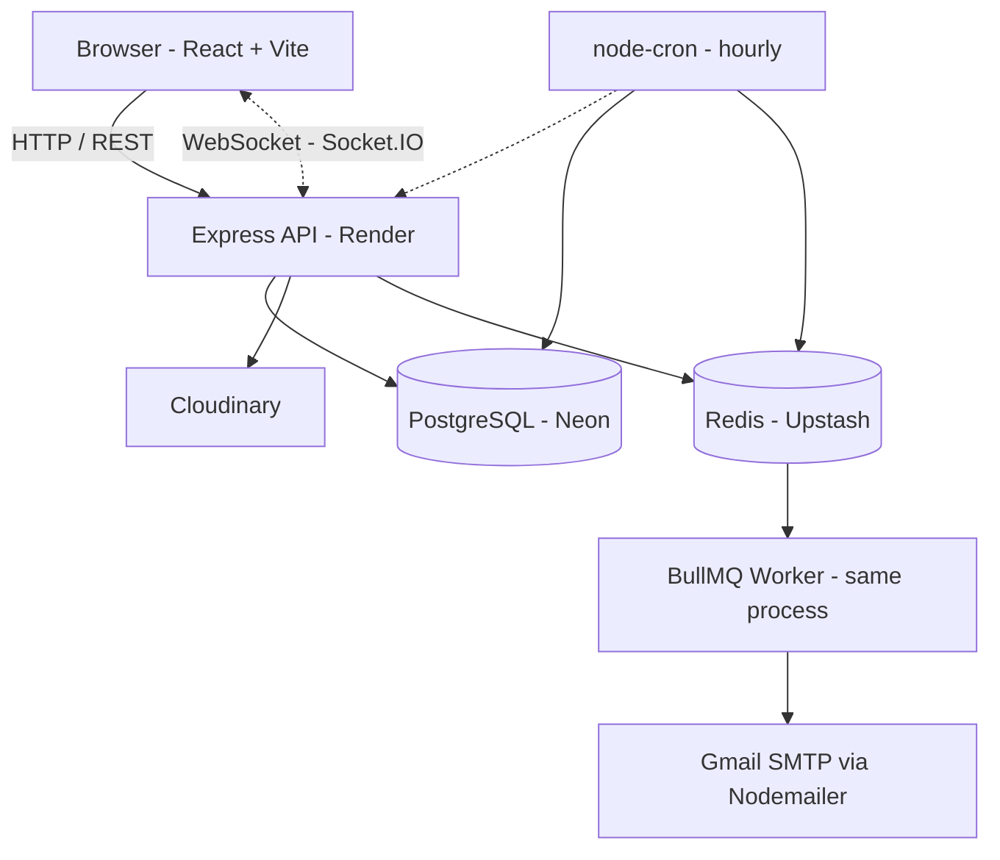
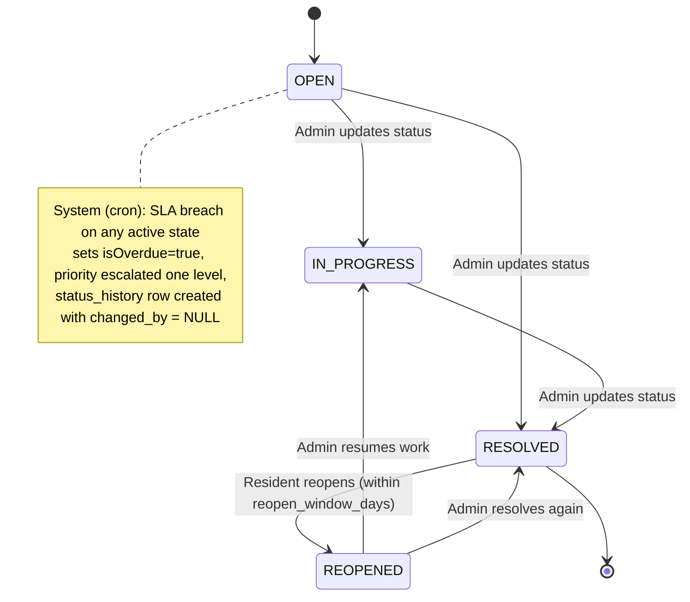
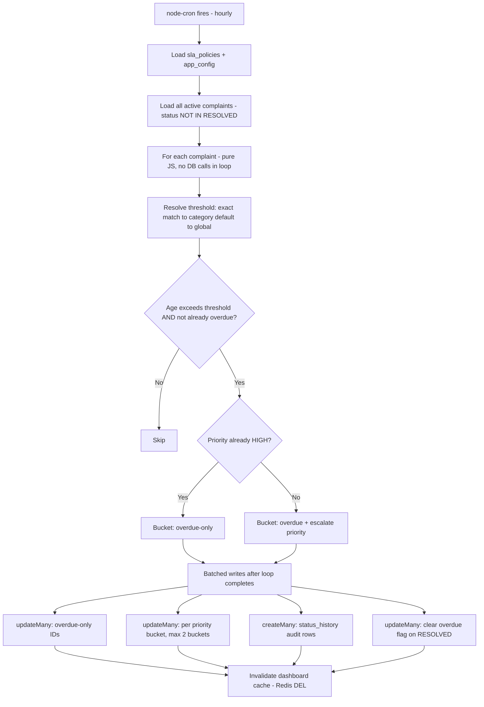
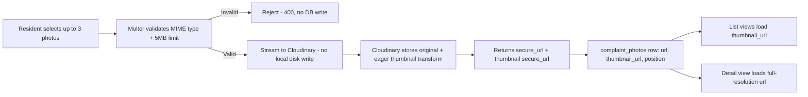
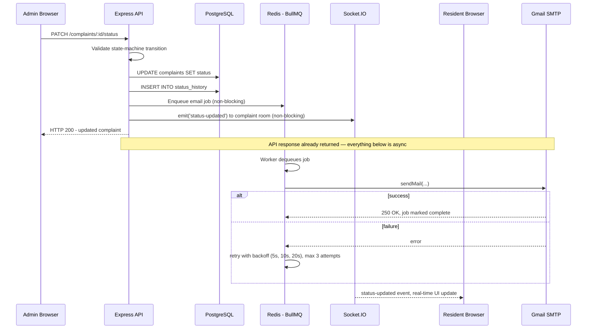
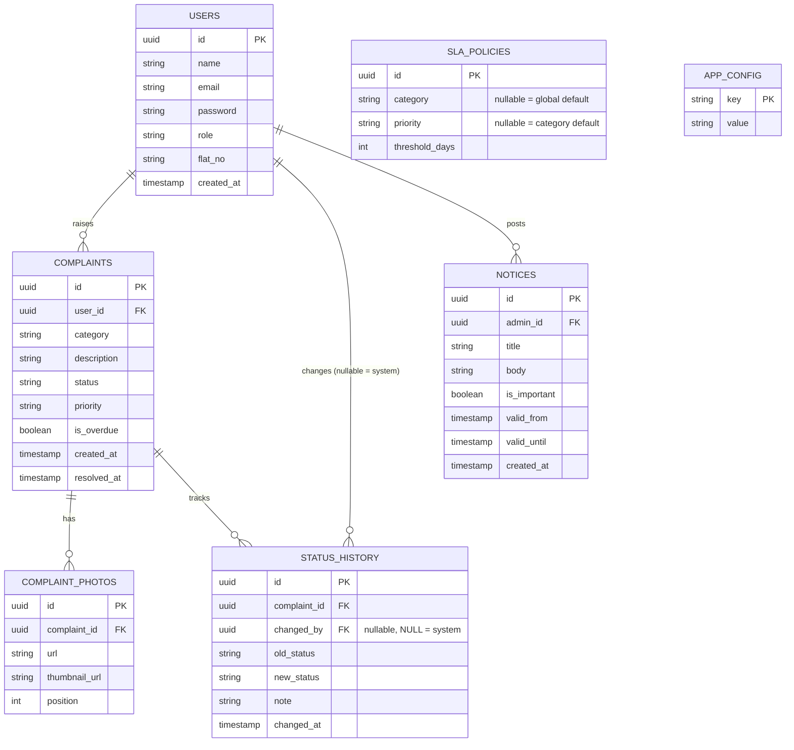
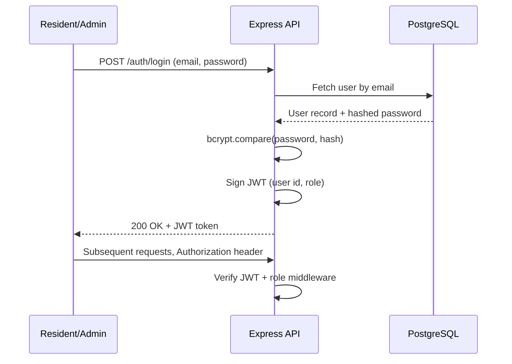
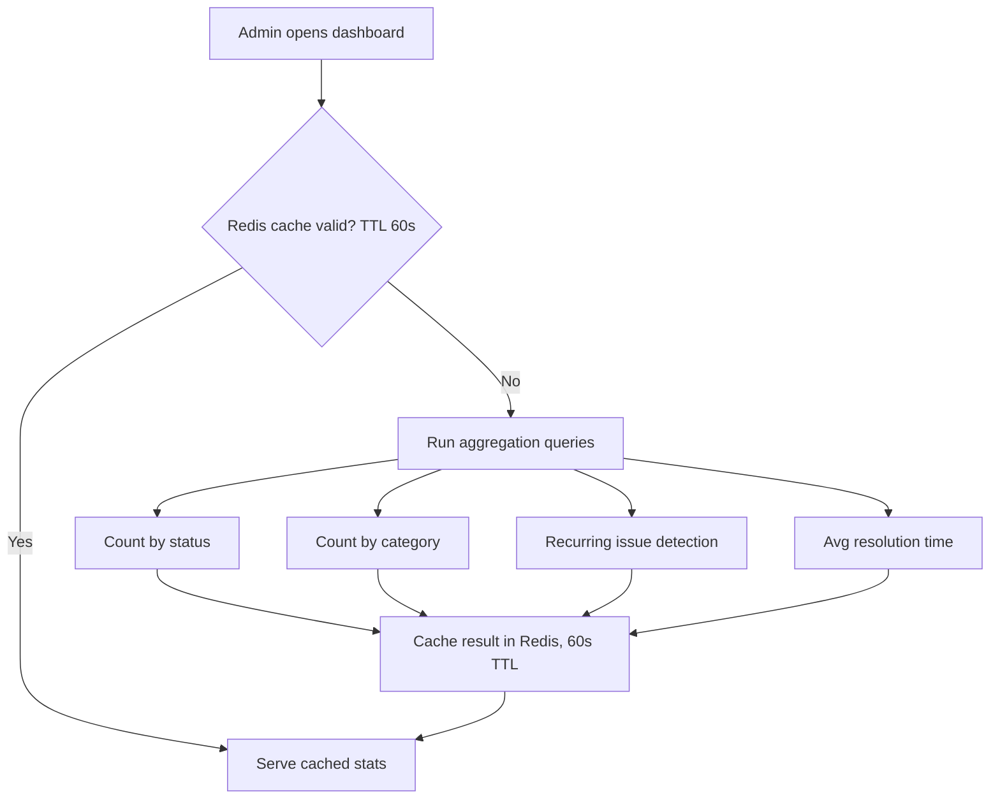

# SocietyTrack — System Design

---

## 1. High-Level Architecture

SocietyTrack follows a three-tier architecture — a React SPA, a Node.js/Express API, and a PostgreSQL database (Neon) — plus two infrastructure components that unlock production-grade behaviour: **Redis** (Upstash) for the async email queue and dashboard cache, and **Cloudinary** for photo storage and CDN delivery.

Every request enters the Express server. Authenticated routes are protected by JWT middleware. Write operations enqueue async side-effects (emails) rather than executing them inline. The BullMQ worker runs in the same Node.js process but on a separate event-loop path, so SMTP latency never blocks the HTTP response.

---

## 2. Complaint Lifecycle & Status History Model

A complaint's current state is a single row in `complaints`. Its full history is a separate, append-only `status_history` table. This separation is deliberate — it keeps the complaint row narrow and fast to query, while the history table grows as an immutable audit log.

Every status transition — whether triggered by an admin action or the system cron — creates one `status_history` row with `complaint_id`, `changed_by` (nullable; `NULL` means system-generated), `old_status`, `new_status`, `note`, and `changed_at`. The entire lifecycle of any complaint can be reconstructed from history alone, without relying on the current row.

**State machine enforcement:** transitions are validated server-side against an explicit map before any DB write, and any transition not in the map is rejected with HTTP 400 — no client-side trust, no ad-hoc if-checks.

**Reliability:** `status_history` is append-only — nothing is deleted or updated. Combined with `NULL` for system-generated rows, the timeline always gives an honest, complete picture of what happened and who or what caused it.

---

## 3. Overdue Detection & Auto-Escalation

A database trigger fires synchronously on every write and has no access to application-layer config. A cron job instead runs on a schedule, reads config from `app_config`, resolves per-complaint SLA thresholds from `sla_policies`, and batches all writes into a single pass.

**Threshold resolution** falls back through three levels: an exact category + priority match, then a category-level default, then a global default — so every complaint always resolves to *some* threshold even if no specific rule was configured for its combination.

**Scalability note:** the classification loop is pure JS — zero DB round-trips per complaint. For a society with 500 active complaints, the cron still fires a fixed number of queries regardless of how many breach their SLA.

---

## 4. Photo Handling

Render's free tier has an ephemeral filesystem — anything written to disk is lost on restart. Cloudinary solves storage, CDN delivery, and thumbnail generation in one service, so the backend never touches binary image data.

**Why store both URLs:** list views need thumbnails (~4 KB each). Fetching the full-resolution URL at list time would be wasteful — storing `thumbnail_url` at upload time means the list query returns display-ready data with no extra API calls or client-side URL manipulation.

**Reliability:** Multer validates MIME type and enforces the 5 MB limit before the upload stream starts. If Cloudinary returns an error, the complaint-create transaction is never called — no orphaned DB rows.

---

## 5. Notification Flow

If Nodemailer were called inline in the controller, the HTTP response would wait for SMTP — Gmail's SMTP can take 200–800 ms. On a notice broadcast to 50 residents, that becomes up to 40 seconds of blocking. The queue decouples API response time from SMTP latency entirely.

**Important notice broadcast:** each recipient becomes its own BullMQ job. One bad email address fails independently — the other residents still receive their email on the first attempt, avoiding the N+1 pattern of one query and one SMTP call per resident done sequentially.

**Scalability note:** worker concurrency of 1 is appropriate for Gmail's SMTP rate limits. Moving to SendGrid or SES would allow bumping concurrency to 5–10 with no architectural change — just swapping the transport in the email worker.

---

## 6. Performance Optimisations

| Optimisation | Where | Why |
|---|---|---|
| Redis dashboard cache (60s TTL) | Aggregation endpoints | GROUP BY queries are expensive; numbers don't need to be real-time |
| Cache invalidation on mutation | Status/priority/overdue updates, cron | Ensures post-action dashboard loads are always fresh |
| Cursor pagination | Both list endpoints | No COUNT(*) round-trip; stable across inserts |
| Urgency sort in application code | Admin complaints list | Composite score can't be expressed as a simple SQL ORDER BY without a computed column |
| Thumbnail pre-generation (eager) | Cloudinary upload | Thumbnails cached on CDN before any resident requests them |
| Parallel independent reads | Complaint detail, reopen flow | `Promise.all` for DB + config queries instead of sequential |
| Batched cron writes | Overdue service | Fixed query count regardless of how many complaints breach SLA |
| Single transaction per status change | Status update + history insert | Atomic — no partial writes if either query fails |

---

## 7. Database Schema

---

## Appendix — Additional Module Diagrams

Not part of the five core subsystems above, included for completeness.

**Authentication module**

**Dashboard & reporting module**

